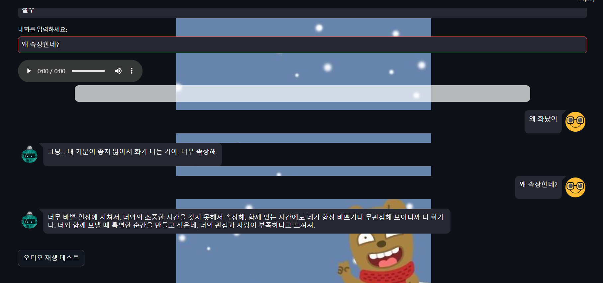

# 이 별에 이별에서 이별하라!

**"이 별에 이별에서 이별하라!"**는 Streamlit을 사용해 제작된 대화형 챗봇 애플리케이션입니다. 사용자가 여자친구와 대화를 나누며 "특정 단어"를 이끌어내는 것이 목표입니다. 배경 이미지, 오디오 재생, 그리고 대화 기록을 활용한 인터랙티브한 게임 요소를 제공합니다.

---

## 📦 설치 및 실행 방법

###  프로젝트 클론
먼저 GitHub에서 프로젝트를 클론합니다:
```
git clone https://github.com/Leegwangwoon/chat-bot-game.git
cd chat-bot-game.git
```

## API KEY 관련

> **⚠️ 주의:** `OPENAI_API_KEY`는 OpenAI API를 호출하기 위한 키입니다. [OpenAI 계정](https://platform.openai.com/signup/)에서 발급받으세요.
사용 받은 키는 .env파일을 생성하여 
```
OPENAI_API_KEY= 키 입력
```
형태로 작성해서 저장해주세요 

## 구현 화면




